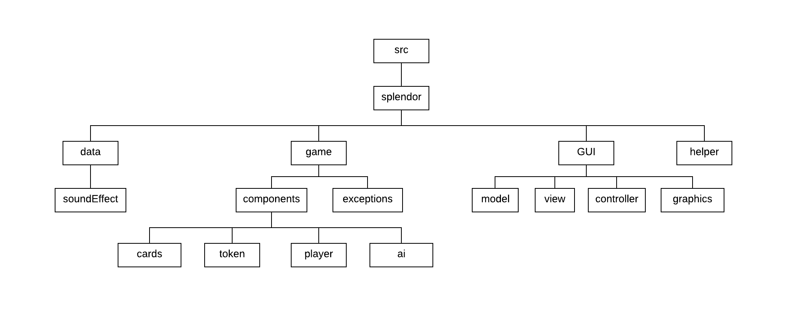
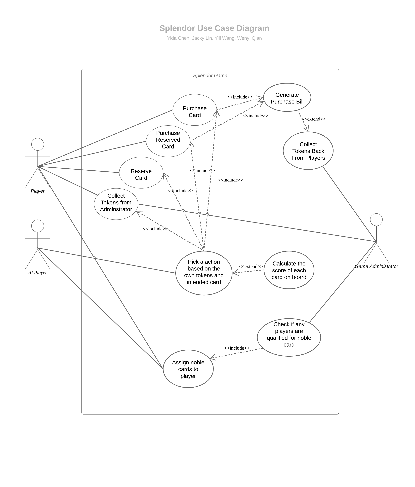
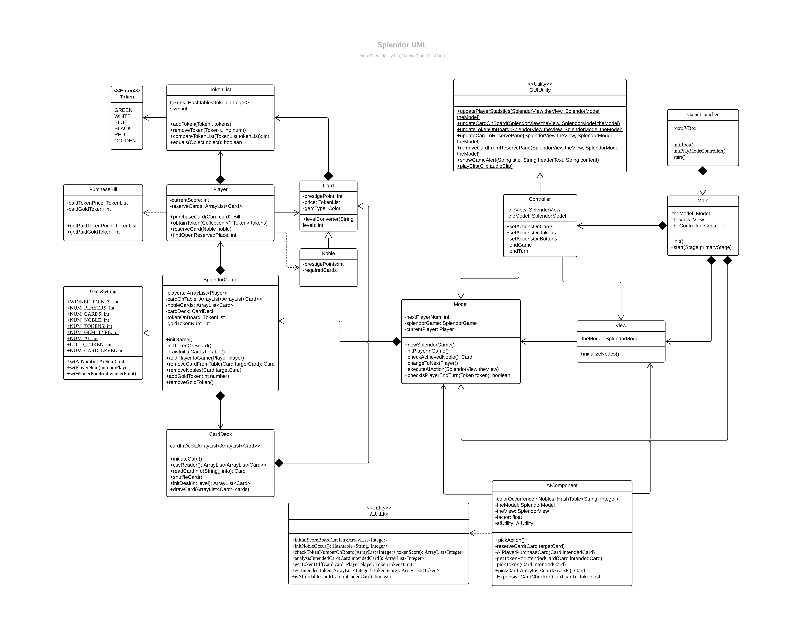

# Splendor Board Game
**SuperLendor Team**

**Team Member: Edward Chen, Jacky Lin, Yili Wang, Wenyi Qian**

**Instructor: Professor King, Lily**
****
#### References
Below are the resource we used to complete our project:

1. <a href="https://docs.oracle.com/javase/8/javafx/api/javafx/scene/control/Alert.html">Oracle - Alert (JavaFx 8)</a>
2. <a href="https://kodejava.org/how-do-i-store-objects-in-file/">Kodejava - How do I store objects in file?</a>
3. <a href="https://boardgamegeek.com/filepage/136731/full-splendor-card-list-wpics">Board Game Geek - Full Splendor Card List</a>

****
#### Overview of the Project
Splendor is a board game in which players can collect tokens and buy cards to earn points and then win the game. 
In each turn, players can either collect tokens or buy cards. Whoever earns the objective points first wins the game.

****
#### Package Structure

****
#### Use case Diagram

****
#### UML Diagram

****
#### Instructions

How to play:
 - <del>Run the .jar file</del> We were not able to build a runnable .jar file
 - Run the "GameLauncher" file to start the game.

In our game: 
1. In the start up menu, you can choose the number of AI players you want, 
and the total number of players in the game. 
2. Winner point can also be changed from 5 to 20.

3. In the game, there are three buttons called "pass", "new", and "quit".
    
    (1). Clicking the "Pass" button will end the current player's turn and change to the next player.
    
    (2). Clicking the "New" button will lead you to the start up menu and you can reset the settings of the game.
    
    (3). Clicking the "Quit" button will close the whole game directly. 

****
#### Game Mode

1. In each turn, players can either collect tokens or buy cards. 
2. When collecting tokens, players can either get 2 tokens of the same color or 3 tokens of different colors. 
3. If the player doesn’t have enough tokens to buy the card, the player can reserve the card and get a golden token. 
4. Golden token can be used as any color of the tokens. One player can reserve at most 3 cards. 
5. If the player does something wrong, our game will pop up warning or information box to prevent it. 
6. Whoever earns the Winner point first wins the game.

